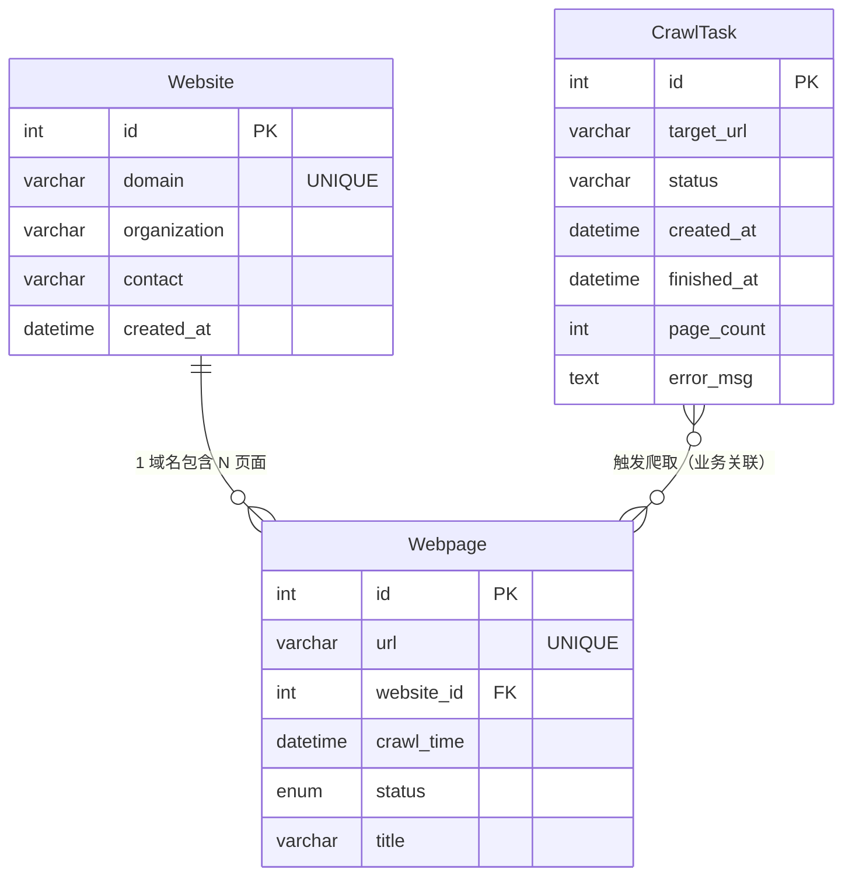

# Web Crawler System — MVP

一个全栈网页爬虫系统，用户通过浏览器提交目标 URL，后端自动爬取该页面及其一层链接，将结构化元数据存入 MySQL，将正文内容存入 MongoDB，并在前端实时展示爬取结果。

---

## 技术栈

| 层 | 技术 |
|---|---|
| 前端 | Vue 3 + Vite + TypeScript + Element Plus |
| 后端 | FastAPI + Uvicorn |
| 爬虫 | Scrapy（由后端以子进程方式调用） |
| 关系型数据库 | MySQL 8.0 |
| 文档数据库 | MongoDB 6.0 |
| 部署 | Docker + Docker Compose |

---

## 架构说明

```
浏览器
  │  HTTP /api/*
  ▼
前端容器 (Vite :5173)
  │  反向代理 /api → backend:8000
  ▼
后端容器 (FastAPI :8000)
  ├── POST /api/tasks   → 写入 MySQL，subprocess 启动 Scrapy
  └── GET  /api/contents → 读取 MongoDB

Scrapy（在后端容器内运行）
  ├── 爬取网页元数据   → MySQL  (Website, Webpage, CrawlTask)
  └── 爬取正文 / 图片  → MongoDB (contents, images)
```

### 数据库分工

**MySQL** — 结构化、强一致性数据：
- `CrawlTask`：任务队列，记录 URL、状态（pending / running / finished / failed）、耗时
- `Website`：去重域名表
- `Webpage`：已爬取页面 URL 去重记录

**MongoDB** — 非结构化、高写入量数据：
- `contents`：正文文本、关键词、爬取时间
- `images`：图片 URL、alt 描述、来源页面

---

## 数据库 Schema

### E-R 图



> `CrawlTask` 与 `Webpage` 之间无数据库外键约束，关联发生在爬虫运行时（Scrapy 通过 `task_id` 参数更新任务状态）。

---

### MySQL 表结构

#### `CrawlTask` — 爬取任务队列

| 列 | 类型 | 约束 | 说明 |
|---|---|---|---|
| `id` | INT | PK, AUTO_INCREMENT | 任务 ID |
| `target_url` | VARCHAR(2048) | NOT NULL | 用户提交的目标 URL |
| `status` | VARCHAR(20) | DEFAULT 'pending' | pending / running / finished / failed |
| `created_at` | DATETIME | | 任务创建时间 |
| `finished_at` | DATETIME | NULL | 爬取完成时间 |
| `page_count` | INT | DEFAULT 0 | 已爬取页面数 |
| `error_msg` | TEXT | NULL | 失败时的错误信息 |

#### `Website` — 域名去重表

| 列 | 类型 | 约束 | 说明 |
|---|---|---|---|
| `id` | INT | PK, AUTO_INCREMENT | |
| `domain` | VARCHAR(255) | NOT NULL, UNIQUE | 域名，如 `quotes.toscrape.com` |
| `organization` | VARCHAR(255) | NULL | 预留字段 |
| `contact` | VARCHAR(255) | NULL | 预留字段 |
| `created_at` | DATETIME | | 首次发现时间 |

#### `Webpage` — 页面元数据表

| 列 | 类型 | 约束 | 说明 |
|---|---|---|---|
| `id` | INT | PK, AUTO_INCREMENT | |
| `url` | VARCHAR(2048) | NOT NULL, UNIQUE | 页面完整 URL |
| `website_id` | INT | FK → Website.id (CASCADE) | 所属域名 |
| `crawl_time` | DATETIME | NOT NULL | 爬取时间 |
| `status` | ENUM | NOT NULL, DEFAULT 'pending' | pending / fetching / success / failed / invalid |
| `title` | VARCHAR(512) | NULL | 页面 `<title>` 内容 |

---

### MongoDB 集合结构

#### `contents` — 正文内容

```json
{
  "_id":          "ObjectId",
  "webpage_url":  "https://example.com/page",
  "text_content": "页面正文文本...",
  "keywords":     [],
  "crawl_time":   "2024-01-01 12:00:00"
}
```

#### `images` — 图片数据

```json
{
  "_id":          "ObjectId",
  "webpage_url":  "https://example.com/page",
  "image_url":    "https://example.com/img/photo.jpg",
  "description":  "alt 文本描述",
  "crawl_time":   "2024-01-01 12:00:00"
}
```

---

## 快速启动（Docker）

**前置条件**：已安装 [Docker Desktop](https://www.docker.com/products/docker-desktop/)

```bash
git clone <repo-url>
cd database-project
docker compose up --build
```

启动完成后：

| 服务 | 地址 |
|---|---|
| 前端页面 | http://localhost:5173 |
| 后端 API 文档 | http://localhost:8000/docs |
| MySQL | localhost:3306 |
| MongoDB | localhost:27017 |

> 首次启动会拉取镜像并安装依赖，约需 3–5 分钟。后续启动直接 `docker compose up`。

**停止并保留数据：**
```bash
docker compose down
```

**停止并清除所有数据（含数据库 volume）：**
```bash
docker compose down -v
```

---

## 本地开发（不使用 Docker）

### 1. 数据库

确保本地 MySQL（端口 3306）和 MongoDB（端口 27017）已运行，MySQL 中存在数据库 `crawler_db`。

### 2. 后端

```bash
cd backend
pip install -r requirements.txt
uvicorn main:app --reload
```

### 3. 前端

```bash
cd frontend
npm install
npm run dev
```

本地开发时无需设置任何环境变量，代码中已配置回退默认值 `127.0.0.1`。

---

## API

### ✅ 已实现

| 方法 | 路径 | 说明 |
|---|---|---|
| `POST` | `/api/tasks` | 提交爬取任务，body: `{"url": "https://..."}` |
| `GET` | `/api/contents` | 获取 MongoDB 最新 50 条爬取正文 |

### ⬜ 未实现

| 方法 | 路径 | 说明 |
|---|---|---|
| `GET` | `/api/tasks` | 获取所有任务列表及状态 |
| `GET` | `/api/tasks/{id}` | 查询单个任务的实时状态 |
| `GET` | `/api/images` | 获取 MongoDB 中已爬取的图片数据（`images.py` 文件尚未创建） |

---

## 项目结构

```
database-project/
├── docker-compose.yml
├── backend/
│   ├── Dockerfile
│   ├── requirements.txt
│   ├── main.py               # FastAPI 入口
│   ├── db/
│   │   ├── mysql.py          # SQLAlchemy 连接
│   │   └── mongo.py          # PyMongo 连接
│   ├── models/
│   │   └── CrawlTask.py      # ORM 模型
│   ├── routers/
│   │   ├── tasks.py          # 任务接口
│   │   └── contents.py       # 内容查询接口
│   └── crawler/              # Scrapy 项目
│       └── crawler/
│           ├── settings.py   # 数据库配置（读取环境变量）
│           ├── items.py
│           ├── pipelines.py  # 双写 MySQL + MongoDB
│           └── spiders/
│               └── general_spider.py
└── frontend/
    ├── Dockerfile
    └── src/
        ├── views/
        │   └── HomeView.vue  # 主页面
        └── api/
            └── task.ts       # axios 封装
```

---

## 功能完成情况

| 功能模块 | 状态 | 说明 |
|---|---|---|
| 任务提交 API | ✅ 已完成 | POST /api/tasks，写入 MySQL CrawlTask 表，subprocess 启动 Scrapy |
| Scrapy 爬虫核心 | ✅ 已完成 | 爬取目标页正文、图片及子链接，深度固定 1 层 |
| MySQL Pipeline | ✅ 已完成 | Website / Webpage / CrawlTask 三表写入，含任务状态流转 |
| MongoDB Pipeline | ✅ 已完成 | contents / images 两个集合写入 |
| 前端内容展示 | ✅ 已完成 | GET /api/contents，展示 MongoDB 最新 50 条爬取正文 |
| Docker Compose 部署 | ✅ 已完成 | 四容器一键启动，支持 macOS / Windows / Linux |
| 任务列表与状态查询 API | ⬜ 待完成 | 缺少 GET /api/tasks 和 GET /api/tasks/{id}，无法查看任务队列与实时状态 |
| 图片读取 API | ⬜ 待完成 | images.py 路由文件尚未创建，GET /api/images 不可用 |
| 前端实时轮询 | ⬜ 待完成 | 当前仅提交后延迟 3 秒刷新一次，任务运行中状态不可见 |
| 关键词提取与搜索 | ⬜ 待完成 | keywords 字段已预留但始终为空数组，全文检索未实现 |
| 图片前端展示 | ⬜ 待完成 | 图片数据已写入 MongoDB，但前端页面未渲染 |
| 用户认证 | ⬜ 待完成 | 所有接口完全公开，JWT 登录保护未实现 |
