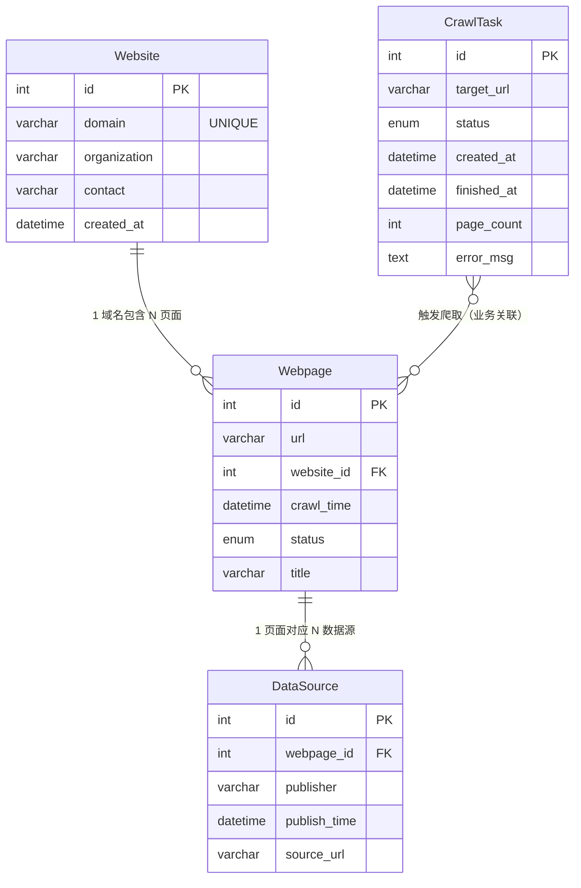

# 网络数据爬取管理系统

一个全栈网页爬虫管理系统。用户通过浏览器提交目标 URL，后端自动爬取页面及其子链接，将结构化元数据存入 MySQL，将正文内容与图片存入 MongoDB，并通过多个管理页面对爬取结果进行检索、查看和管理。

---

## 技术栈

| 层 | 技术 |
|---|---|
| 前端 | Vue 3 + Vite + TypeScript + Element Plus |
| 后端 | FastAPI + Uvicorn |
| 爬虫 | Scrapy（由后端以子进程方式调用） |
| 关系型数据库 | MySQL 8.0 |
| 文档数据库 | MongoDB 6.0 |
| 部署 | Docker + Docker Compose |

---

## 系统架构

```
浏览器
  │  HTTP /api/*
  ▼
前端容器 (Vite :5173)
  │  反向代理 /api → backend:8000
  ▼
后端容器 (FastAPI :8000)
  ├── POST   /api/tasks            → 写入 MySQL CrawlTask，subprocess 启动 Scrapy
  ├── GET    /api/tasks            → 任务列表分页查询
  ├── GET    /api/contents         → 内容检索（关键字 + 时间范围 + 分页）
  ├── GET    /api/contents/export/csv → 检索结果导出 CSV
  ├── GET    /api/images           → 图片列表（描述关键字 + 分页）
  ├── GET    /api/websites         → 网站列表
  ├── GET    /api/webpages         → 网页列表（按网站过滤 + 分页）
  ├── DELETE /api/webpages/{id}    → 级联删除网页及其 MongoDB 内容/图片
  └── GET    /api/stats            → 系统统计数据

Scrapy（在后端容器内运行）
  ├── 爬取网页元数据   → MySQL  (Website, Webpage, CrawlTask)
  └── 爬取正文 / 图片  → MongoDB (contents, images)
```

---

## 数据库设计

### E-R 图



> `CrawlTask` 与 `Webpage` 之间无数据库外键约束，关联发生在爬虫运行时（Scrapy 通过 `task_id` 参数更新任务状态）。

---

### MySQL 表结构

#### `CrawlTask` — 爬取任务队列

| 列 | 类型 | 约束 | 说明 |
|---|---|---|---|
| `id` | INT | PK, AUTO_INCREMENT | 任务 ID |
| `target_url` | VARCHAR(2048) | NOT NULL | 用户提交的目标 URL |
| `status` | ENUM | DEFAULT 'pending' | pending / running / completed / failed |
| `created_at` | DATETIME | | 任务创建时间 |
| `finished_at` | DATETIME | NULL | 爬取完成时间 |
| `page_count` | INT | DEFAULT 0 | 已爬取页面数 |
| `error_msg` | TEXT | NULL | 失败时的错误信息 |

#### `Website` — 域名去重表

| 列 | 类型 | 约束 | 说明 |
|---|---|---|---|
| `id` | INT | PK, AUTO_INCREMENT | |
| `domain` | VARCHAR(255) | NOT NULL, UNIQUE | 域名，如 `books.toscrape.com` |
| `organization` | VARCHAR(255) | NULL | 所属机构（预留） |
| `contact` | VARCHAR(255) | NULL | 联系方式（预留） |
| `created_at` | DATETIME | | 首次发现时间 |

#### `Webpage` — 页面元数据表

| 列 | 类型 | 约束 | 说明 |
|---|---|---|---|
| `id` | INT | PK, AUTO_INCREMENT | |
| `url` | VARCHAR(2048) | NOT NULL | 页面完整 URL |
| `website_id` | INT | FK → Website.id (CASCADE) | 所属域名 |
| `crawl_time` | DATETIME | NOT NULL | 爬取时间 |
| `status` | ENUM | NOT NULL, DEFAULT 'pending' | pending / fetching / success / failed / invalid |
| `title` | VARCHAR(512) | NULL | 页面 `<title>` 内容 |

> `url` 列通过前缀索引（768 字符）保证唯一性，避免 utf8mb4 下全列索引超过 InnoDB 3072 字节上限。

#### `DataSource` — 数据源信息表

| 列 | 类型 | 约束 | 说明 |
|---|---|---|---|
| `id` | INT | PK, AUTO_INCREMENT | |
| `webpage_id` | INT | FK → Webpage.id (CASCADE) | 所属网页 |
| `publisher` | VARCHAR(255) | NULL | 数据发布者 |
| `publish_time` | DATETIME | NULL | 发布时间 |
| `source_url` | VARCHAR(2048) | NULL | 原始数据链接 |

---

### MongoDB 集合结构

#### `contents` — 正文内容

```json
{
  "_id":          "ObjectId",
  "webpage_url":  "https://example.com/page",
  "text_content": "页面正文文本（body 内所有可见文本节点）",
  "keywords":     [],
  "crawl_time":   "2026-04-29 12:00:00"
}
```

#### `images` — 图片数据

```json
{
  "_id":          "ObjectId",
  "webpage_url":  "https://example.com/page",
  "image_url":    "https://example.com/img/photo.jpg",
  "description":  "img alt 文本",
  "crawl_time":   "2026-04-29 12:00:00"
}
```

---

## 快速启动（Docker）

**前置条件**：已安装 [Docker Desktop](https://www.docker.com/products/docker-desktop/)

```bash
git clone git@github.com:wtanjo/database-project.git
cd database-project
docker compose up --build
```

启动完成后：

| 服务 | 地址 |
|---|---|
| 前端页面 | http://localhost:5173 |
| 后端 API 文档（Swagger） | http://localhost:8000/docs |
| MySQL | localhost:3306 |
| MongoDB | localhost:27017 |

> 首次启动会拉取镜像并安装依赖，约需 3–5 分钟。后续启动直接 `docker compose up`。

**停止并保留数据：**
```bash
docker compose down
```

**停止并清除所有数据（含数据库 volume）：**
```bash
docker compose down -v
```

---

## 本地开发（不使用 Docker）

### 1. 数据库

确保本地 MySQL（端口 3306）和 MongoDB（端口 27017）已运行，MySQL 中存在数据库 `crawler_db`。

### 2. 后端

```bash
cd backend
pip install -r requirements.txt
uvicorn main:app --reload
```

### 3. 前端

```bash
cd frontend
npm install
npm run dev
```

本地开发时无需设置任何环境变量，代码中已配置回退默认值 `127.0.0.1`。

---

## 功能模块

### 仪表盘

- 统计卡片：爬取任务总数、已收录网站数、内容条目数、图片数量
- 任务状态分布：排队中 / 执行中 / 已完成 / 失败
- 网页数 Top 10 网站排行

### 爬取管理

- 输入目标 URL，一键提交爬取任务
- 任务列表展示（ID、URL、状态、页数、提交时间、完成时间、错误信息）
- 每 5 秒自动轮询刷新任务状态

### 内容检索

- 正文关键字模糊搜索
- 爬取时间范围筛选
- 分页展示（卡片式，含标题、URL、正文预览、图片缩略图）
- 一键导出检索结果为 CSV

### 图片管理

- 自适应网格展示所有爬取图片
- 按描述关键字过滤
- 支持大图预览

### 网站管理

- 网站列表与网页列表双栏联动
- 点击网站可筛选其下所有网页
- 网页级联删除（同步删除 MongoDB 中对应的正文和图片）

---

## API 接口

| 方法 | 路径 | 说明 |
|---|---|---|
| `POST` | `/api/tasks` | 提交爬取任务，body: `{"target_url": "https://..."}` |
| `GET` | `/api/tasks` | 任务列表，支持 `page` / `page_size` 分页 |
| `GET` | `/api/contents` | 内容检索，支持 `keyword` / `start_time` / `end_time` / `page` / `page_size` |
| `GET` | `/api/contents/export/csv` | 导出检索结果为 CSV |
| `GET` | `/api/images` | 图片列表，支持 `keyword` / `page` / `page_size` |
| `GET` | `/api/websites` | 网站列表，支持 `page` / `page_size` |
| `GET` | `/api/webpages` | 网页列表，支持 `website_id` 过滤 + `page` / `page_size` |
| `DELETE` | `/api/webpages/{id}` | 删除网页及其 MongoDB 内容与图片 |
| `GET` | `/api/stats` | 系统统计数据 |

所有接口均返回统一格式：

```json
{
  "code": 0,
  "message": "success",
  "data": { ... }
}
```

列表类接口的 `data` 结构：

```json
{
  "total": 100,
  "page": 1,
  "page_size": 10,
  "items": [ ... ]
}
```

---

## 项目结构

```
database-project/
├── docker-compose.yml
├── backend/
│   ├── Dockerfile
│   ├── requirements.txt
│   ├── main.py                   # FastAPI 入口，注册所有路由
│   ├── utils.py                  # 统一响应格式工具函数
│   ├── db/
│   │   ├── mysql.py              # SQLAlchemy 连接 + get_db 依赖
│   │   └── mongo.py              # PyMongo 连接，contents / images 集合
│   ├── models/
│   │   ├── CrawlTask.py
│   │   ├── Website.py
│   │   ├── Webpage.py
│   │   └── DataSource.py
│   ├── routers/
│   │   ├── tasks.py              # POST + GET /api/tasks
│   │   ├── contents.py           # GET /api/contents + CSV 导出
│   │   ├── images.py             # GET /api/images
│   │   ├── websites.py           # GET /api/websites
│   │   ├── webpages.py           # GET + DELETE /api/webpages
│   │   └── stats.py              # GET /api/stats
│   └── crawler/                  # Scrapy 项目
│       └── crawler/
│           ├── settings.py       # 数据库配置（读取环境变量，回退本地默认值）
│           ├── items.py          # WebpageMetaItem / ContentItem / ImageItem / TaskErrorItem
│           ├── pipelines.py      # 双写 MySQL + MongoDB，任务状态流转
│           └── spiders/
│               └── general_spider.py  # 通用爬虫，XPath 提取全页可见文本
└── frontend/
    ├── Dockerfile
    └── src/
        ├── api/
        │   └── index.ts          # 所有接口的 axios 封装
        ├── components/
        │   └── AppLayout.vue     # 侧边栏布局
        └── views/
            ├── DashboardView.vue
            ├── TasksView.vue
            ├── ContentsView.vue
            ├── ImagesView.vue
            └── WebsitesView.vue
```

---

## 推荐测试网站

以下网站专为爬虫练习设计，无反爬限制：

| 网站 | URL | 特点 |
|---|---|---|
| Quotes to Scrape | `https://quotes.toscrape.com/` | 名言文本，多页分页，适合测试正文爬取 |
| Books to Scrape | `https://books.toscrape.com/` | 书籍列表含封面图片，适合测试图片爬取 |
