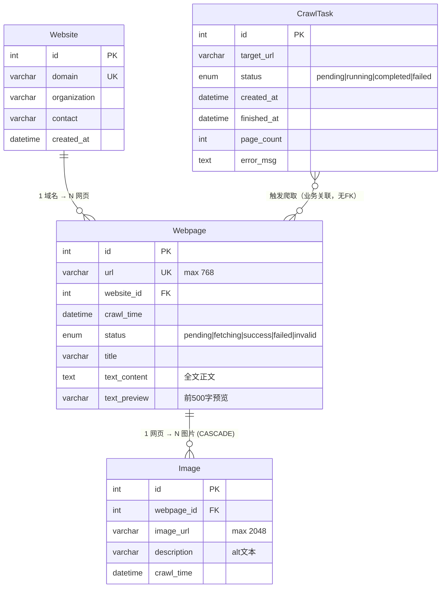

# 网络数据爬取管理系统

全栈网页爬虫管理系统。前端提交目标 URL，后端异步启动 Scrapy 爬取页面及子链接，**所有检索以 MySQL 为主引擎**，MongoDB 仅做冗余备份。提供仪表盘、内容检索、图片管理、网页管理等功能。

---

## 技术栈

| 层 | 技术 |
|---|---|
| 前端 | Vue 3 + Vite + TypeScript + Element Plus |
| 后端 | FastAPI + Uvicorn |
| 爬虫 | Scrapy（子进程调用） |
| 主数据库 | **MySQL 8.0**（元数据 + 正文 + 图片检索） |
| 备份数据库 | MongoDB 6.0（Pipeline 双写备份） |
| 部署 | Docker Compose |

> **设计原则**：MySQL 承担全部 CRUD 与检索，MongoDB 仅做冗余备份。这是数据库课程项目的核心要求——通过 SQL 完成关系型数据库的建表、查询、索引优化等练习。

---

## 系统架构

```
浏览器 (Vue 3 :5173)
  │  /api/*  (Vite proxy → backend:8000)
  ▼
FastAPI 后端 (:8000)
  ├── POST   /api/tasks              → 写入 CrawlTask，子进程启动 Scrapy
  ├── GET    /api/tasks              → 任务列表（MySQL）
  ├── GET    /api/contents           → 内容检索：关键字 + 时间（MySQL Webpage 表）
  ├── GET    /api/contents/export/csv → CSV 导出（MySQL）
  ├── GET    /api/images             → 图片检索：描述关键字 + 时间（MySQL Image 表）
  ├── GET    /api/websites           → 网站列表（MySQL Website 表）
  ├── GET    /api/webpages           → 网页列表（MySQL Webpage 表）
  ├── GET    /api/webpages/{id}/detail → 网页详情（MySQL Webpage + Image 表）
  ├── DELETE /api/webpages/{id}      → 级联删除（MySQL CASCADE + MongoDB 异步清理）
  └── GET    /api/stats              → 统计数据（MySQL）

Scrapy 爬虫管道
  ├── WebpageMetaItem  → MySQL Website + Webpage
  ├── ContentItem      → MySQL Webpage (UPDATE text_content) + MongoDB 备份
  └── ImageItem        → MySQL Image 表 + MongoDB 备份
```

---

## 数据库设计

### E-R 图


```mermaid
erDiagram
    CrawlTask {
        int       id          PK
        varchar   target_url
        enum      status      "pending|running|completed|failed"
        datetime  created_at
        datetime  finished_at
        int       page_count
        text      error_msg
    }

    Website {
        int       id           PK
        varchar   domain       UK
        varchar   organization
        varchar   contact
        datetime  created_at
    }

    Webpage {
        int       id           PK
        varchar   url          UK "max 768"
        int       website_id   FK
        datetime  crawl_time
        enum      status       "pending|fetching|success|failed|invalid"
        varchar   title
        text      text_content  "全文正文"
        varchar   text_preview  "前500字预览"
    }

    Image {
        int       id           PK
        int       webpage_id   FK
        varchar   image_url    "max 2048"
        varchar   description  "alt文本"
        datetime  crawl_time
    }

    Website ||--o{ Webpage : "1 域名 → N 网页"
    Webpage ||--o{ Image : "1 网页 → N 图片 (CASCADE)"
    CrawlTask }o--o{ Webpage : "触发爬取（业务关联，无FK）"
```

### MySQL 表结构

#### `CrawlTask` — 爬取任务

| 列 | 类型 | 约束 | 说明 |
|---|---|---|---|
| `id` | INT | PK AUTO_INCREMENT | |
| `target_url` | VARCHAR(2048) | NOT NULL | 用户提交的目标 URL |
| `status` | ENUM('pending','running','completed','failed') | NOT NULL, DEFAULT 'pending' | |
| `created_at` | DATETIME | DEFAULT NOW() | 任务创建时间 |
| `finished_at` | DATETIME | NULL | 爬取完成时间 |
| `page_count` | INT | DEFAULT 0 | 已爬取页面数 |
| `error_msg` | TEXT | NULL | 失败信息 |

#### `Website` — 域名去重

| 列 | 类型 | 约束 | 说明 |
|---|---|---|---|
| `id` | INT | PK AUTO_INCREMENT | |
| `domain` | VARCHAR(255) | NOT NULL UNIQUE | 如 `books.toscrape.com` |
| `organization` | VARCHAR(255) | NULL | 所属机构 |
| `contact` | VARCHAR(255) | NULL | 联系方式 |
| `created_at` | DATETIME | DEFAULT NOW() | |

#### `Webpage` — 网页（元数据 + 正文）

| 列 | 类型 | 约束 | 说明 |
|---|---|---|---|
| `id` | INT | PK AUTO_INCREMENT | |
| `url` | VARCHAR(768) | NOT NULL UNIQUE | 768 字节索引上限 |
| `website_id` | INT | FK→Website(id) ON DELETE CASCADE | |
| `crawl_time` | DATETIME | NOT NULL | |
| `status` | ENUM | NOT NULL, DEFAULT 'pending' | |
| `title` | VARCHAR(512) | NULL | `<title>` 内容 |
| `text_content` | LONGTEXT | NULL | **全文正文（检索主字段）** |
| `text_preview` | VARCHAR(500) | NULL | 前 500 字预览 |

#### `Image` — 图片

| 列 | 类型 | 约束 | 说明 |
|---|---|---|---|
| `id` | INT | PK AUTO_INCREMENT | |
| `webpage_id` | INT | FK→Webpage(id) ON DELETE CASCADE | |
| `image_url` | VARCHAR(2048) | NOT NULL | |
| `description` | VARCHAR(1024) | NULL | img alt 文本 |
| `crawl_time` | DATETIME | DEFAULT NOW() | |

### 查询索引策略

| 表 | 索引列 | 用途 |
|---|---|---|
| `Webpage` | `crawl_time` | 内容列表按时间排序 |
| `Webpage` | `url` (UNIQUE) | 去重 + 关联查询 |
| `Webpage` | `text_content` (FULLTEXT 可选) | 关键字检索 |
| `Image` | `webpage_id` | 按网页查图片 |
| `Image` | `crawl_time` | 图片列表排序 |
| `Website` | `domain` (UNIQUE) | 域名去重 |

### MongoDB 集合（备份）

> MongoDB 仅作为 Pipeline 双写备份，**不参与任何 API 检索**。

```json
// contents 集合
{ "webpage_url": "...", "text_content": "...", "keywords": [], "crawl_time": "..." }

// images 集合
{ "webpage_url": "...", "image_url": "...", "description": "...", "crawl_time": "..." }
```

---

## 快速启动

### Docker（推荐）

```bash
git clone git@github.com:wtanjo/database-project.git
cd database-project
docker compose up --build
```

> 注意：Docker 构建过程中需要从外部拉取镜像和依赖包，网络环境可能会影响构建速度或导致失败。

| 服务 | 地址 |
|---|---|
| 前端 | http://localhost:5173 |
| API 文档 (Swagger) | http://localhost:8000/docs |
| MySQL | localhost:3306 |
| MongoDB | localhost:27017 |

```bash
docker compose down       # 停止（保留数据）
docker compose down -v    # 停止并清空数据库
```

### 本地开发

MySQL（3306）和 MongoDB（27017）需先运行。

```bash
# 后端
cd backend && pip install -r requirements.txt && uvicorn main:app --reload

# 前端
cd frontend && npm install && npm run dev
```

---

## API 接口

所有接口返回统一格式：`{ "code": 0, "message": "success", "data": {...} }`

| 方法 | 路径 | 查询引擎 | 说明 |
|---|---|---|---|
| `POST` | `/api/tasks` | MySQL | 提交爬取任务 |
| `GET` | `/api/tasks` | MySQL | 任务列表（分页） |
| `GET` | `/api/contents` | **MySQL** | 关键字 + 时间检索正文 |
| `GET` | `/api/contents/export/csv` | **MySQL** | 检索结果导出 CSV |
| `GET` | `/api/images` | **MySQL** | 图片列表（描述关键字 + 时间） |
| `GET` | `/api/websites` | MySQL | 网站列表（分页） |
| `GET` | `/api/webpages` | MySQL | 网页列表（域名/URL 过滤） |
| `GET` | `/api/webpages/{id}/detail` | **MySQL** | 网页正文 + 图片详情 |
| `DELETE` | `/api/webpages/{id}` | MySQL + MongoDB | 级联删除 |
| `GET` | `/api/stats` | **MySQL** | 系统统计 |

### 检索接口示例

```bash
# 关键字检索
curl "http://localhost:8000/api/contents?keyword=database&page=1&page_size=10"

# 时间范围 + 关键字
curl "http://localhost:8000/api/contents?keyword=python&start_time=2026-01-01&end_time=2026-06-01"

# 图片描述检索
curl "http://localhost:8000/api/images?keyword=logo&page=1&page_size=20"

# 网页详情
curl "http://localhost:8000/api/webpages/42/detail"
```

---

## 功能模块

| 模块 | 路由 | 功能 |
|---|---|---|
| **仪表盘** | `/` | 任务数/网站数/内容数/图片数统计卡片，任务状态分布，Top 10 网站 |
| **爬取管理** | `/tasks` | 提交 URL → 异步 Scrapy 爬取，任务列表 5 秒轮询 |
| **内容检索** | `/contents` | 正文关键字 LIKE 搜索 + 时间范围过滤 + 分页 + CSV 导出 |
| **图片管理** | `/images` | 网格展示，description LIKE 搜索，大图预览 |
| **网页管理** | `/webpages` | 域名/URL 过滤，抽屉详情（正文高亮搜索 + 图片），级联删除 |
| **网站管理** | `/websites` | 域名列表，点击跳转网页管理 |

---

## 项目结构

```
database-project/
├── docker-compose.yml
├── ASSIGNMENT_REQUIREMENTS.md     # 作业硬性要求清单
├── backend/
│   ├── Dockerfile
│   ├── requirements.txt
│   ├── main.py                    # FastAPI 入口
│   ├── utils.py                   # success/error/paginate 工具
│   ├── db/
│   │   ├── mysql.py               # SQLAlchemy 连接 + get_db
│   │   └── mongo.py               # PyMongo 连接（备份用）
│   ├── models/
│   │   ├── CrawlTask.py           # 任务模型（含 Status 枚举）
│   │   ├── Website.py             # 网站模型
│   │   ├── Webpage.py             # 网页模型（全文 + 预览列）
│   │   └── Image.py               # 图片模型（FK→Webpage）
│   ├── routers/
│   │   ├── tasks.py               # 任务 CRUD + URL 验证
│   │   ├── contents.py            # 正文检索（MySQL LIKE）
│   │   ├── images.py              # 图片检索（MySQL）
│   │   ├── websites.py            # 网站列表
│   │   ├── webpages.py            # 网页列表 + 详情 + 级联删除
│   │   └── stats.py               # 统计数据
│   └── crawler/
│       └── crawler/
│           ├── settings.py        # Scrapy 配置 + DB 连接
│           ├── items.py           # Item 定义
│           ├── pipelines.py       # 双写 MySQL + MongoDB
│           └── spiders/
│               └── general_spider.py  # 通用爬虫
└── frontend/
    ├── Dockerfile
    └── src/
        ├── api/index.ts           # axios 封装
        ├── components/AppLayout.vue
        └── views/
            ├── DashboardView.vue
            ├── TasksView.vue
            ├── ContentsView.vue
            ├── ImagesView.vue
            ├── WebsitesView.vue
            └── WebpagesView.vue
```

---

## 推荐测试网站

| 网站 | URL | 特点 |
|---|---|---|
| Quotes to Scrape | `https://quotes.toscrape.com/` | 名言文本，多页 |
| Books to Scrape | `https://books.toscrape.com/` | 书籍列表 + 封面图片 |

---

## Git 分支

| 分支 | 说明 |
|---|---|
| `main` | 最新版本（MySQL 主检索 + 全功能） |
| `dev` | 开发主线 |
| `bugfix/cleanup-redundant-bugs` | Bug 修复 + 死代码清理（已合入 dev） |
| `refactor/mysql-primary-retrieval` | 检索回归 MySQL 重构（已合入 main） |
